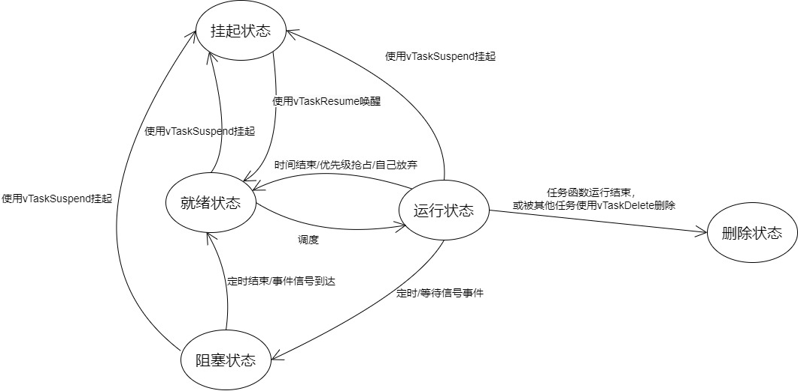

# 前言

> 这一节主要包括任务相关的操作和延迟函数等内容。在此之前，我们需要已经裁剪了FreeRTOS的官方程序，亦或者是移植了FreeRTOS到自己的项目中，这使得能够让我们开始FreeRTOS之旅。


# Source Insight

首先，在一切开始之前，先介绍一个工具`Source Insight`，如果仅仅是使用它的文本编辑功能，那么它就是一个强大的文本编辑器，但是通过各种配置，可以变成一个方便的IDE。这里，我是使用其作为项目中代码编辑的功能，而编译和调试代码则是使用`Keil`。这样既避免了`Source Insight`编译代码的各种配置，而且也充分利用了它强大的编辑功能。

Source Insight的官网是[https://www.sourceinsight.com/](https://www.sourceinsight.com/)，仅仅只是为了学习，所以可以使用一些破解版来代替。

使用方法：每次都需要建一个项目，然后把所有源代码文件添加进项目，这样`Source Insight`才能正确分析语法，然后为编写代码提供提示的帮助。相当于半个一个代码智能补全了，虽然比不上`Visual Studio`那种非常智能的，但是也比`Keil`强大的多，足够使用了。


# 任务的基础概念

首先，我们所写的单片机程序是一个程序，也可以叫做是一个应用程序（Application）。所谓的任务就是做事的，程序可以有多个任务，也就是说，一个程序是可以同时做多个事情。比如，我们可以同时打印信息，也可以同时控制一个Led灯的闪烁。如果没有任务的概念，那么我们需要通过一些手段来让CPU打印完信息以后转去控制Led，然后反复。而有了任务的概念，我们可以创建两个任务，一个用于做打印的事情，另外一个用于控制Led灯，`FreeRTOS`通过引入任务的概念来降低多个事情要同时做在代码实现上的复杂性。

也有的人管这种任务叫做线程，实际上都是做事的。在Linux或者是Windows这样的操作系统中，把一个运行着的应用程序叫做进程，操作系统按照进程给应用程序分配资源。应用程序中有多个事情同时做的需求，因而有了线程，线程也分为两种，一种是通过操作系统提供实现的，另外一种是自己实现的。

而在嵌入式实时系统`FreeRTOS`中的任务，一般来说就当做是类似于线程的东西，因为我们的单片机多是单核的，这样我们的应用程序应该算是一个进程一样的东西。然后在里面多个事情一起做，只能算是线程。

总结一下，任务就是一个做事的东西，通过创建多个任务来实现一起做事情。


# 动态创建任务和静态创建任务

在`FreeRTOS`中的任务创建有两种，分别是**动态创建任务**和**静态创建任务**。本质区别是是否通过动态内存分配。静态创建任务会事先分配好任务控制块（Task Control Block，TCB）和栈。而且要注意一个点，要使用任务的时候，必须先包含`task.h`头文件。


## 测试前准备

在开始之前，先配置好串口，这里通过Keil的模拟器来测试，通过打印信息到串口辅助测试。

关键点在于初始化好串口，这里我使用的是`USART1`，其次，要实现一下标准库的`fputc`函数，因为这样可以覆盖掉标准库的，从而能够让标准库的`printf`打印内容输出到串口。简而言之就是`fputc`函数的一个重定向。

初始化`USART`应该不是什么难事，可以参考`FreeRTOS`中的Demo里的实现。先是一个时钟和GPIO的初始化，然后各种配置，开启中断等等。下面是Demo中的实现。为了能够减少篇幅，删除了不必要的空行。

```c
static void prvSetupHardware( void )
{
	/* Start with the clocks in their expected state. */
	RCC_DeInit();
	/* Enable HSE (high speed external clock). */
	RCC_HSEConfig( RCC_HSE_ON );
	/* Wait till HSE is ready. */
	while( RCC_GetFlagStatus( RCC_FLAG_HSERDY ) == RESET ) { }
	/* 2 wait states required on the flash. */
	*( ( unsigned long * ) 0x40022000 ) = 0x02;
	/* HCLK = SYSCLK */
	RCC_HCLKConfig( RCC_SYSCLK_Div1 );
	/* PCLK2 = HCLK */
	RCC_PCLK2Config( RCC_HCLK_Div1 );
	/* PCLK1 = HCLK/2 */
	RCC_PCLK1Config( RCC_HCLK_Div2 );
	/* PLLCLK = 8MHz * 9 = 72 MHz. */
	RCC_PLLConfig( RCC_PLLSource_HSE_Div1, RCC_PLLMul_9 );
	/* Enable PLL. */
	RCC_PLLCmd( ENABLE );
	/* Wait till PLL is ready. */
	while(RCC_GetFlagStatus(RCC_FLAG_PLLRDY) == RESET) { }
	/* Select PLL as system clock source. */
	RCC_SYSCLKConfig( RCC_SYSCLKSource_PLLCLK );
	/* Wait till PLL is used as system clock source. */
	while( RCC_GetSYSCLKSource() != 0x08 ) { }
	/* Enable GPIOA, GPIOB, GPIOC, GPIOD, GPIOE and AFIO clocks */
	RCC_APB2PeriphClockCmd(	RCC_APB2Periph_GPIOA | RCC_APB2Periph_GPIOB |RCC_APB2Periph_GPIOC
							| RCC_APB2Periph_GPIOD | RCC_APB2Periph_GPIOE | RCC_APB2Periph_AFIO, ENABLE );
	/* SPI2 Periph clock enable */
	RCC_APB1PeriphClockCmd( RCC_APB1Periph_SPI2, ENABLE );
	/* Set the Vector Table base address at 0x08000000 */
	NVIC_SetVectorTable( NVIC_VectTab_FLASH, 0x0 );
	NVIC_PriorityGroupConfig( NVIC_PriorityGroup_4 );
	/* Configure HCLK clock as SysTick clock source. */
	SysTick_CLKSourceConfig( SysTick_CLKSource_HCLK );
	SerialPortInit();
}

void SerialPortInit(void)
{
	unsigned long ulWantedBaud = 115200;
	USART_InitTypeDef USART_InitStructure;
	GPIO_InitTypeDef GPIO_InitStructure;
	
	/* If the queue/semaphore was created correctly then setup the serial port
	hardware. */
	/* Enable USART1 clock */
	RCC_APB2PeriphClockCmd( RCC_APB2Periph_USART1 | RCC_APB2Periph_GPIOA, ENABLE );	

	/* Configure USART1 Rx (PA10) as input floating */
	GPIO_InitStructure.GPIO_Pin = GPIO_Pin_10;
	GPIO_InitStructure.GPIO_Mode = GPIO_Mode_IN_FLOATING;
	GPIO_Init( GPIOA, &GPIO_InitStructure );
	
	/* Configure USART1 Tx (PA9) as alternate function push-pull */
	GPIO_InitStructure.GPIO_Pin = GPIO_Pin_9;
	GPIO_InitStructure.GPIO_Speed = GPIO_Speed_50MHz;
	GPIO_InitStructure.GPIO_Mode = GPIO_Mode_AF_PP;
	GPIO_Init( GPIOA, &GPIO_InitStructure );

	USART_InitStructure.USART_BaudRate = ulWantedBaud;
	USART_InitStructure.USART_WordLength = USART_WordLength_8b;
	USART_InitStructure.USART_StopBits = USART_StopBits_1;
	USART_InitStructure.USART_Parity = USART_Parity_No ;
	USART_InitStructure.USART_HardwareFlowControl = USART_HardwareFlowControl_None;
	USART_InitStructure.USART_Mode = USART_Mode_Rx | USART_Mode_Tx;
	USART_InitStructure.USART_Clock = USART_Clock_Disable;
	USART_InitStructure.USART_CPOL = USART_CPOL_Low;
	USART_InitStructure.USART_CPHA = USART_CPHA_2Edge;
	USART_InitStructure.USART_LastBit = USART_LastBit_Disable;
	
	USART_Init( USART1, &USART_InitStructure );
	
	//USART_ITConfig( USART1, USART_IT_RXNE, ENABLE );
			
	USART_Cmd( USART1, ENABLE );		
}
```

在初始化完硬件以后要做实现`fputc`函数的工作，这里示例用的是寄存器操作，如果用标准库或者是HAL库都是可以的。

```c
int fputc(int ch, FILE *f)
{
	USART_TypeDef* USARTx = USART1;
	while ((USARTx->SR & (1<<7)) == 0);
	USARTx->DR = ch;
	return ch;
}
```


## 静态创建任务

如何通过静态的方式来创建一个任务，首先，需要在`FreeRTOS.h`文件中找到`configSUPPORT_STATIC_ALLOCATION`宏的定义，把它的定义值从0改为1，因为只有这样，才能启用静态创建任务。

接下来就要关注静态创建任务的函数`xTaskCreateStatic`了，下面是它的函数声明和相关类型的定义。因为`portUSING_MPU_WRAPPERS`宏默认是被设置为1的，这样，所有的函数会多一次宏替换，也就是我们的`xTaskCreateStatic`，本质上是被替换为`MPU_xTaskCreateStatic`，如果不要这一层包裹（Wrapper），可以把`portUSING_MPU_WRAPPERS`宏设置为0。

```c
#define xTaskCreateStatic                      MPU_xTaskCreateStatic
#define portSTACK_TYPE    uint32_t
#define uint32_t unsigned long
typedef void (*TaskFunction_t)(void *);
typedef unsigned long    UBaseType_t;
typedef portSTACK_TYPE   StackType_t;
typedef struct tskTaskControlBlock* TaskHandle_t;
TaskHandle_t MPU_xTaskCreateStatic(TaskFunction_t pxTaskCode, 
                                   const char * const pcName,
                                   const uint32_t ulStackDepth,
                                   void * const pvParameters,
                                   UBaseType_t uxPriority,
                                   StackType_t * const puxStackBuffer,
                                   StaticTask_t * const pxTaskBuffer ) /* FREERTOS_SYSTEM_CALL */
```

首先是第一个参数`pxTaskCode`，根据命名来看，是任务执行的代码，也就是C语言中的函数。其类型`TaskFunction_t`是一个函数指针，也就是指向了一个没有返回值，参数为`void*`类型的一个指针。比如，想要让一个任务做一些事情，可以把做事情的代码放在一个函数里，然后把函数的地址传进去，因为指针内部存储的就是地址。

然后再来看第二个参数`pcName`，它是一个`const char * const`类型的指针，也就是说，指针的指向和指针指向的内容都是不能改变的。我们权且可以认为是一个字符串。它就是用于告诉`FreeRTOS`，创建的任务是什么名字。

第三个参数`ulStackDepth`是栈的深度，一般填100就够用了。所谓的栈，我们之前讲过，是用于函数调用、局部变量定义等这些事情的。如果我们调用函数过多，然后就栈会很深，如果栈不够大，就回不来，就会爆栈。这个大致理解就行。这里`const uint32_t`，也就是说这是一个常量类型，而且是一个无符号的32位整型。

之后是第四个参数`pvParameters`，是传入任务函数的参数，如果没有需要传入的参数那就填NULL。其类型是一个`void*`类型，刚好是`TaskFunction_t`类型中函数的参数类型。

第五个参数`uxPriority`，是任务的优先级。这是一个无符号的`long`类型，任务的优先级越高越容易被执行，但是如果一个优先级很高的任务一直不给其他任务机会，也就是不把控制权给出来，那其他任务可能会饿死，也就是不被执行。在这里，数字越大，优先级越高。

第六个参数`puxStackBuffer`，通过这个参数给任务提供一块内存作为栈。类型是一个`StackType_t`类型的指针，`StackType_t`类型又是通过`portSTACK_TYPE`宏定义的，而`portSTACK_TYPE`被定义为`uint32_t`类型，`uint32_t`就是一个无符号的32位整数。我们可以直接定义一个`StackType_t`类型的全局数组作为任务的栈。

第七个参数`pxTaskBuffer`，这个是一个保留的，直接填NULL就行。`StaticTask_t`类型的话是对`struct xSTATIC_TCB`类型的一个别名。这里不需要过多关系这个参数。如果说不想传入一个NULL，也可以定义一个`StaticTask_t`类型变量，然后把地址传进去。

返回值是一个控制块的指针，如果不需要的话可以不管，如果需要那就定义一个变量存起来。`TaskHandle_t`类型是一个结构体类型指针（`struct tskTaskControlBlock*`），这个具体如何不需要关心，只需要知道通过可以通过返回来的`TaskHandle_t`类型的变量来操作这个任务。返回的这个东西，我们一般称作为句柄，所谓句柄，可以理解为一个杯子上的柄，通过柄来拿杯子，这是对杯子的操作。而我们如果要对任务操作，那就是通过句柄来操作的。


总结一下，在静态创建任务函数中，最重要的是第一个参数，因为这个决定了任务执行的代码。下面写一个例子，创建两个任务，分别在打印1和2。`vTaskStartScheduler`这个是一定要调用的，要不然`FreeRTOS`不能帮我们实现多任务运行和切换。

```c
#include <stdio.h>
#include "FreeRTOS.h"
#include "task.h"
#include "queue.h"
#include "stm32f10x_it.h"

void TaskPrint1Function(void* param)
{
    while (1) {
		printf("1");
	}
}

void TaskPrint2Function(void* param)
{
    while (1) {
		printf("2");
	}
}

StackType_t xTask1Stack[100];
StackType_t xTask2Stack[100];
StaticTask_t xTask1TCB;
StaticTask_t xTask2TCB;

int main( void )
{
    // 硬件初始化代码省略
    // ...
    xTaskCreateStatic(TaskPrint1Function, "Task1", 100, NULL, 1, xTask1Stack, &xTask1TCB);
    TaskHandle_t handle = xTaskCreateStatic(TaskPrint2Function, "Task2", 100, NULL, 1, xTask2Stack, &xTask2TCB);
    // 开启任务调度器
    vTaskStartScheduler();
	return 0;
}
```


## 动态创建任务

动态创建任务的函数`xTaskCreate`，可以通过`configSUPPORT_DYNAMIC_ALLOCATION`宏来决定是否启用动态任务创建。与静态任务创建好的是，没有对`xTaskCreate`进行使用宏包装。下面是它的定义。

```c
BaseType_t xTaskCreate(TaskFunction_t pxTaskCode,
                       const char * const pcName, /*lint !e971 Unqualified char types are allowed for strings and single characters only. */
                       const configSTACK_DEPTH_TYPE usStackDepth,
                       void * const pvParameters,
                       UBaseType_t uxPriority,
                       TaskHandle_t * const pxCreatedTask )
```

有了前面的基础，很容易能够理解第一个参数`pxTaskCode`是任务的函数。然后第二个参数是任务的名字。第三个参数是栈的深度`configSTACK_DEPTH_TYPE`这个类型是通过宏定义的，是一个整型，具体多大要看宏是如何定义的，我们可以直接跟前面一样，平常都直接写100就够用。然后第四个参数是传入任务的参数。第五个是任务的优先级。

从第六个参数开始与前面静态创建任务函数不同了，其作用是相当于前面静态创建任务函数返回的那个句柄。而返回值是一个`BaseType_t`类型，返回有两种可能，如果是`pdPASS`，那就说明创建任务成功了，而如果是`errCOULD_NOT_ALLOCATE_REQUIRED_MEMORY`则是代表创建任务失败，因为没有足够的内存可以分配。

因此，跟之前静态函数不一样的是，我们需要在动态创建任务之后判断是否成功。下面是一个例子。

```c
#include <stdio.h>
#include "FreeRTOS.h"
#include "task.h"
#include "queue.h"
#include "stm32f10x_it.h"

void TaskPrint1Function(void* param)
{
    while (1) {
		printf("1");
	}
}

void TaskPrint2Function(void* param)
{
    while (1) {
		printf("2");
	}
}

int main( void )
{
	// 硬件初始化代码省略
    // ...
	TaskHandle_t xHandleTask1;
	BaseType_t ret = xTaskCreate(TaskPrint1Function, "Task1", 100, NULL, 1, &xHandleTask1);
    if(errCOULD_NOT_ALLOCATE_REQUIRED_MEMORY == ret) {
        printf("创建Task1失败！");
    }
	if(errCOULD_NOT_ALLOCATE_REQUIRED_MEMORY == xTaskCreate(TaskPrint2Function, "Task2", 100, NULL, 1, NULL)) {
        printf("创建Task2失败！");
    }
    // 开启任务调度器
	vTaskStartScheduler();
	return 0;
}
```

注意，我们是可以使用一个函数创建多个任务的，也就是在创建多个任务的时候，都指定为一个函数作为任务的函数。


## 如何选择静态创建任务和动态创建任务

当内存比较紧缺的时候，我们需要提前规划好内存占用的时候选用静态创建任务，反之则选用动态创建任务。动态创建任务下，栈的内存由动态内存分配获取，有可能会失败，因此需要判断是否创建任务成功。对于判断创建任务的结果，不管是用一个变量存储返回结果还是直接放在if里面判断，都是可以的。


# 任务的状态

在`FreeRTOS`中任务有五种状态。而任务的转换是基于`SysTick`中断的，因为这个中断是会间隔一定时间固定被执行，这就给了转换执行不同任务的机会。

1. 就绪状态（Ready）：任务已经创建，且满足运行的条件，但还未被调度执行。任务在就绪状态时等待调度器将其放入运行状态。
2. 运行状态（Running）：任务正在执行中，占用CPU资源。
3. 阻塞状态（Blocked）：任务因为某些原因暂时无法执行，例如等待某个事件发生、等待某个资源的释放等。阻塞状态的任务不会占用CPU资源。
4. 挂起状态（Suspended）：任务被显式地挂起，暂停执行。挂起的任务不会参与调度，也不会占用CPU资源。
5. 删除状态（Deleted）：任务已经被删除，但仍然占用内存空间，直到被内存管理机制释放。

任务转换图：



整个任务状态中，如果我们进行手动挂起之类的操作，往往只接触到就绪状态、运行状态、删除状态。所谓就绪状态就是我们通过`xTaskCreate`这样的方式创建任务，创建好的时候就是就绪状态，而等到使用`vTaskStartScheduler`开始运行任务调度器的时候，这个时候就会开始运行任务，当运行到创建的任务时候，这个时候的任务就是运行状态。而任务中的代码运行完了，任务就进入删除状态。


# 任务状态的操作

## 删除任务

不管是`xTaskCreate`还是`xTaskCreateStatic`创建的任务，删除时候都使用`vTaskDelete  `函数。函数的声明如下。

```c
void vTaskDelete( TaskHandle_t pxTask );
```

其中的参数`pxTask`就是`xTaskCreate`的最后一个参数，或者是`xTaskCreateStatic`的返回值。

当一个任务被删除的时候，这个任务的句柄就不能再用了，就跟C语言中，如果释放了一个指针指向的内存，那么这个指针就不能再次使用了。对于动态创建任务所需要的内存，当这个任务被删除的时候，空闲任务会负责回收内存。如果一个任务要结束自己，那么调用的时候传入`NULL`即可。


## 任务延迟

任务延迟，也就是让当前任务停下来，等一段时间以后再继续执行。如果是在裸机中，延迟一段时间，可能是使用循环来让CPU空转，但是这样会导致CPU浪费。而在`FreeRTOS`中则会让CPU先去执行其他任务，等到延迟过去了以后再回来执行。

而任务延迟主要是两个函数，分别是`vTaskDelay`和`vTaskDelayUntil`。两者的定义如下，`TickType_t`就是一个整型，具体是32位还是16位就要看情况了。

```c
void vTaskDelay(TickType_t xTicksToDelay);
void vTaskDelayUntil(TickType_t *pxPreviousWakeTime, TickType_t xTimeIncrement);
BaseType_t xTaskDelayUntil(TickType_t * const pxPreviousWakeTime, const TickType_t xTimeIncrement )
```

`vTaskDelay`的作用是让当前任务进入到阻塞状态，然后至少等待指定个数的Tick Interrupt才能变为就绪状态。而`vTaskDelayUntil`这个函数因为历史原因因此有两个版本。一个是有返回值的，一个是没有返回值的。两者的作用都是让当前任务进入到阻塞状态，然后等待到指定的绝对时刻，才变为就绪态。有返回值的版本中，返回的可能是`pdTRUE`代表确实延迟了一段时间，而返回`pdFALSE`表示没有发生延迟（因为延迟的时间点早就过了）。


## 挂起任务

挂起任务会让一个任务进入挂起状态，而挂起状态相当于一个任务的代码暂停执行了。跟前面阻塞状态不同的是，挂起并不会被动进入就绪状态，只能是唤醒才能进入就绪状态。所以说挂起和唤醒是两个相反的操作。比如一个任务需要另外一个任务先做一部分的时候，这个时候就可以先自己把自己挂起了，之后等到另外一个任务做完它的事情以后来唤醒自己。

任务的挂起使用`vTaskSuspend`函数，其函数声明如下。

```c
void vTaskSuspend(TaskHandle_t xTaskToSuspend);
```

`vTaskSuspend`函数的参数非常简单，就是需要被挂起任务的句柄。


## 唤醒任务

既然已经知道了挂起任务，那么与之对应的`vTaskResume`唤醒任务函数，使用方法也是一样的。

```c
void vTaskResume(TaskHandle_t pxTaskToResume);
```


# 空闲任务和钩子函数

空闲任务是`FreeRTOS`中负责清理工作的一个任务。当一个动态创建的任务被删除或者是任务结束的时候，创建这个任务所需要的内存会被空闲任务自动回收。空闲任务只有两种状态，分别是运行状态和就绪状态。

通过重写`vApplicationIdleHook`就可以实现对`portTASK_FUNCTION`的Hook。先明白什么是Hook，这里Hook的意思是钩子，也就是，在`FreeRTOS`中，我们通过定义一个`vApplicationIdleHook`来让我们的代码能够在`FreeRTOS`中已经定义好的空闲任务中插入运行一段代码，这种插入代码的方式叫做钩子函数。`portTASK_FUNCTION`这个函数是是真正的空闲任务处理任务，里面会进行一个死循环。

空闲钩子函数可以执行一些一些低优先级的、后台的、需要连续执行的代码。除此之外还可以，测量系统的空闲时间，因为空闲任务能被执行就意味着所有的高优先级任务都停止了，所以测量空闲任务占据的时间，就可以算出处理器占用率。还可以让系统进入省电模式，空闲任务能被执行就意味着没有重要的事情要做，当然可以进入省电模式了。对于空闲任务的钩子函数的要求是尽量的快，不能一直卡在里面不出来，这就是所谓的高效执行。如果钩子函数一直卡住，那原本空闲任务处理函数里面回收内存的代码就不能正常运行，然后内存就无法回收。因此空闲任务钩子函数不能应该被挂起和阻塞。

空闲任务钩子函数的声明如下。

```c
void vApplicationIdleHook(void);
```


# 任务调度

在运行的任务，被称为"正在使用处理器"，它处于运行状态。在单处理器系统中，任何时间里只能有一个任务处于运行状态。

任务状态可以主要分为运行和非运行状态，而非运行状态包括：阻塞（Blocked）、挂起（Suspended）、就绪（Ready）。

就绪态的任务，可以被调度器挑选出来切换为运行状态，调度器永远都是挑选最高优先级的就绪态任务并让它进入运行状态。

阻塞状态的任务，它在等待"事件"，当事件发生时任务就会进入就绪状态。事件分为两类，分别是时间相关的事件和同步事件。


## 事件

### 时间相关的事件

所谓时间相关的事件，就是设置超时时间。在指定时间内阻塞，时间到了就进入就绪状态。使用时间相关的事件，可以实现周期性的功能、可以实现超时功能。


#### 同步事件

同步事件就是，某个任务在等待某些信息，别的任务或者中断服务程序会给它发送信息。通过同步信息，使得多个任务之间能够互相协作。

而任务同步的方式有很多，包括任务通知(task notification)、队列(queue)、事件组(event group)、信号量(semaphoe)、互斥量(mutex)。这些方法用来发送同步信息，比如表示某个外设得到了数据，然后就可以通知另外一个事件来处理了。关于如何在`FreeRTOS`中使用这些东西将会在后面讲解。


## 任务调度策略

所谓的调度策略就是如何协调多个任务之间的运转和切换。其主要是以下问题的不同使得有了不同的调度策略。

* 是否抢占？
* 允许抢占时，是否允许时间片轮转？
* 允许抢占、允许时间片轮转时，空闲任务是否让步？

任务调度策略主要是分为：抢占式调度、时间片调度、协作式调度（合作式调度）。一般来说，`FreeRTOS`主要是抢占式调度和时间片调度。


### 抢占式调度和协作式调度

在协作式调度下，高优先级任务不会抢占当前正在运行状态的低优先级任务，直到低优先级任务完成进入阻塞状态或就绪状态或者被挂起后才会切换任务。

`FreeRTOS`的默认调度策略是抢占式调度。在默认情况下，`FreeRTOS`使用优先级抢占式调度器。在抢占式调度下，任务的优先级越高，被调度的概率就越大。当一个任务的时间片用尽或者有更高优先级的任务就绪时，调度器会立即切换到更高优先级的任务执行。

这种默认的抢占式调度策略可以确保高优先级任务及时响应，同时在多任务场景下合理分配系统资源。但是，如果需要使用其他调度策略，`FreeRTOS`也提供了相应的配置选项，可以根据具体需求进行调整。


### 时间片轮转

时间片，就是把一段时间等分成了很多个时间段，在每一个时间段保证优先级最高的任务能执行，同时如果几个任务拥有相等的优先级，则它们会轮流使用每个时间段占用CPU资源。调度器会在每个时间片结束的时候通过周期中断（tick interrupt）执行一次，调度器根据设置的抢占式还是合作式模式选择哪个任务在下一个时间片会运行。


## 任务调度器

任务调度器就是通过执行算法来实现任务调度策略，从而对任务实现管理的东西。